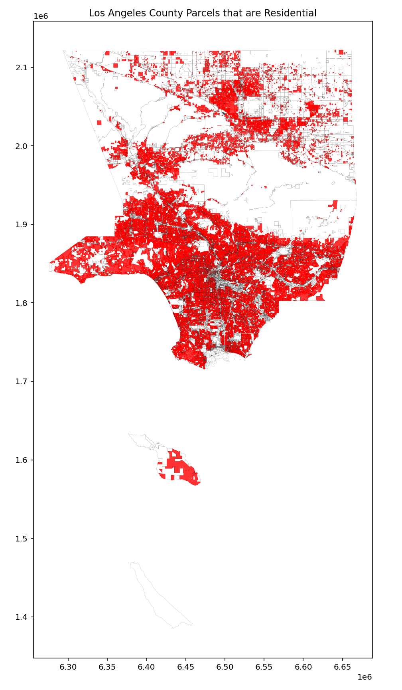

# Python Data Exercise

This project involves reading a file of parcel data. 
The script downloads, unzips, disolves and plots the data on a map.

## Project Structure

- `data/`: Directory containing the input data files.
  - `LACounty_Parcels.gdb`: The file containing parcel `polygons` layers.
- `output/`: Directory where the processed data will be saved.
- `source_code.py`: The main Python script that performs the processing.
- `requirements.txt`: Python dependencies required to run the script.

## Output
- This analysis shows that the approximate Residential land area in the County is 2,436 square miles.
- The total land area in the County is 5,209 square miles.



## Prerequisites

- Python 3.11.3 or later
- A virtual environment is recommended

## Setup and Installation

*!! make sure you are in the project directory*

1. **Create a Virtual Environment** (optional)
    ```bash
    python3 -m venv User_dir
    source User_dir/bin/activate  # On Windows: User_dir\Scripts\activate
    ```

2. **Install Dependencies**:
    To install all required dependencies, run:
    ```bash
    pip install -r requirements.txt
    ```
3. **Input Data**:
    - Make sure `LACounty_Parcels.gdb` that contains parcel `polygons` layers is in the `data/` directory.

## Running the Script

You can run the script using the following command:

```bash
python3 source_code.py   # On Windows: python source_code.py
```

### Troubleshooting
If you encounter any issues, ensure that:

 - You have the correct version of Python installed.
 - All dependencies are installed correctly (check `requirements.txt`).
 - You have the input data file input_data.gpkg in the correct location.