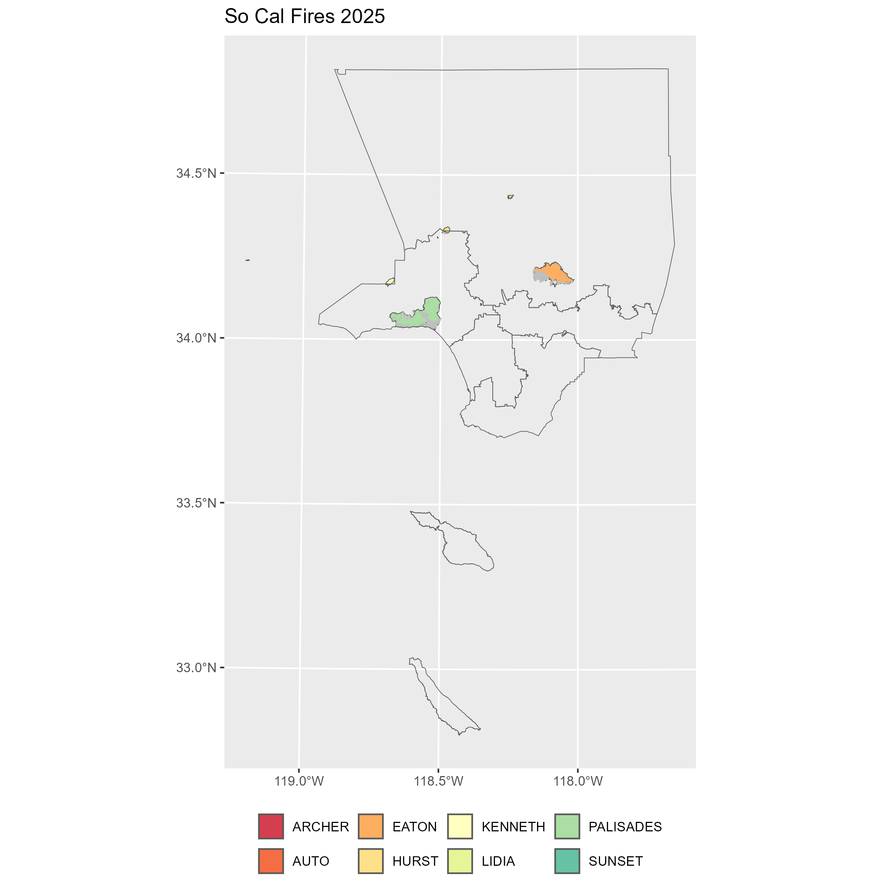

# Data Visualization Projects

## Objective
This repo is dedicated to sharing miscellaneous data visualization projects with others.

Most of my visualization work is coded with R, directories will include datasets. Code files will include comments to walk through different steps of generating the visualization.

## Summary

| **Topic**                                        | **Main Packages**                     | **Source**                    |
|:-------------------------------------------------|:--------------------------------------|:------------------------------|
| [SoCalFires 2025](./So_Cal_Fires_2025)           | tidyverse, sf                         | SoCalFires 2025, LACO Parcels |

# Gallery

## [SoCalFires 2025](./So_Cal_Fires_2025)

Approximately 15,131 homes were damaged and the cost to rebuild is about USD 31.62 Billion. 

