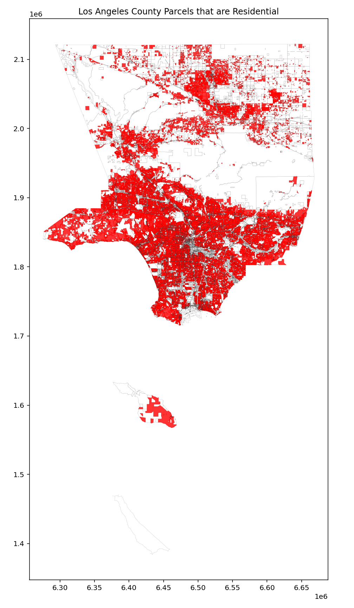

# Data Visualization Projects

## Objective
This repo is dedicated to sharing miscellaneous data visualization projects with others.

Most of my visualization work is coded with R, directories will include datasets. Code files will include comments to walk through different steps of generating the visualization.

## Summary

| **Topic**                                        | **Main Packages**                     | **Source**                    |
|:-------------------------------------------------|:--------------------------------------|:------------------------------|
| [SoCalFires 2025](./So_Cal_Fires_2025)           | tidyverse, sf                         | SoCalFires 2025, LACO Parcels |
| [Residential Land](./LACO_Residential_Land)      | tidyverse, sf                         | LACO Assessor's data          |

# Gallery

## [SoCalFires 2025](./So_Cal_Fires_2025)

This analysis shows that approximately 15,131 homes were damaged and the cost to rebuild is about USD 31.62 Billion.

|**Event Name**|**Residences in fire boundaries**|**Est. Pcnt Burned**|**Est Home Price**|**Est Total Residential Losses**|
|:-------------|---------------------------------|--------------------|------------------|-------------------------------:|
|PALISADES     |                           10,614|            8,491.2|    3,062,178|                    $26.0B|
|EATON         |                            8,232|            6,585.6|      848,945|                     $5.6B|
|HURST         |                               56|               44.8|      548,383|                   $24.57M|
|KENNETH       |                                6|                4.8|      548,383|                    $2.63M|
|LIDIA         |                                5|                4.0|      548,383|                    $2.19M|
|SUNSET        |                                1|                0.8|      548,383|                     $439K|
|Total         |                           18,914|           15,131.2|            0|                    $31.6B|

## [Los Angeles County Residential Land](./LACO_Residential_Land)

- This analysis shows that the approximate Residential land area in the County is 2,436 square miles.
- The total land area in the County is 5,209 square miles.

